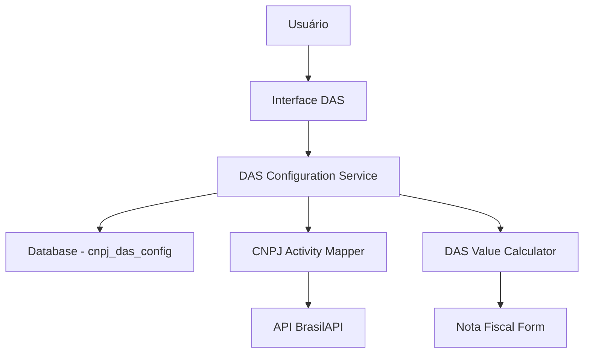

# Documento de Design - Valor DAS por CNPJ

## Visão Geral

Este documento detalha o design técnico para implementar um sistema de gerenciamento de valores específicos do DAS por CNPJ, substituindo o valor fixo atual por um sistema flexível que permite configuração individual por empresa e tipo de atividade.

## Arquitetura

### Componentes Principais

1. **DAS Configuration Service**: Serviço para gerenciar configurações de DAS
2. **CNPJ Activity Mapper**: Mapeador de tipos de atividade por CNPJ
3. **DAS Value Calculator**: Calculadora de valores específicos
4. **Migration Service**: Serviço para migração de dados existentes

### Fluxo de Dados



## Componentes e Interfaces

### 1. Estrutura de Banco de Dados

#### Nova Tabela: `cnpj_das_config`
```sql
CREATE TABLE cnpj_das_config (
  id INT PRIMARY KEY AUTO_INCREMENT,
  cnpj VARCHAR(18) NOT NULL,
  valor_das_mensal DECIMAL(10,2) NOT NULL,
  tipo_atividade VARCHAR(100),
  ano_referencia INT NOT NULL DEFAULT YEAR(CURDATE()),
  valor_padrao BOOLEAN DEFAULT FALSE,
  justificativa TEXT,
  created_at TIMESTAMP DEFAULT CURRENT_TIMESTAMP,
  updated_at TIMESTAMP DEFAULT CURRENT_TIMESTAMP ON UPDATE CURRENT_TIMESTAMP,
  created_by INT,
  FOREIGN KEY (created_by) REFERENCES usuarios(id),
  UNIQUE KEY unique_cnpj_ano (cnpj, ano_referencia)
);
```

#### Nova Tabela: `das_valores_base`
```sql
CREATE TABLE das_valores_base (
  id INT PRIMARY KEY AUTO_INCREMENT,
  tipo_atividade VARCHAR(100) NOT NULL,
  valor_mensal DECIMAL(10,2) NOT NULL,
  ano_referencia INT NOT NULL,
  ativo BOOLEAN DEFAULT TRUE,
  created_at TIMESTAMP DEFAULT CURRENT_TIMESTAMP,
  updated_at TIMESTAMP DEFAULT CURRENT_TIMESTAMP ON UPDATE CURRENT_TIMESTAMP,
  UNIQUE KEY unique_tipo_ano (tipo_atividade, ano_referencia)
);
```

#### Nova Tabela: `das_historico_alteracoes`
```sql
CREATE TABLE das_historico_alteracoes (
  id INT PRIMARY KEY AUTO_INCREMENT,
  cnpj VARCHAR(18) NOT NULL,
  valor_anterior DECIMAL(10,2),
  valor_novo DECIMAL(10,2) NOT NULL,
  justificativa TEXT,
  alterado_por INT NOT NULL,
  data_alteracao TIMESTAMP DEFAULT CURRENT_TIMESTAMP,
  FOREIGN KEY (alterado_por) REFERENCES usuarios(id)
);
```

### 2. Interfaces TypeScript

```typescript
// types/das-config.ts
export interface CNPJDASConfig {
  id: number;
  cnpj: string;
  valor_das_mensal: number;
  tipo_atividade?: string;
  ano_referencia: number;
  valor_padrao: boolean;
  justificativa?: string;
  created_at: Date;
  updated_at: Date;
  created_by?: number;
}

export interface DASValorBase {
  id: number;
  tipo_atividade: string;
  valor_mensal: number;
  ano_referencia: number;
  ativo: boolean;
  created_at: Date;
  updated_at: Date;
}

export interface DASHistoricoAlteracao {
  id: number;
  cnpj: string;
  valor_anterior?: number;
  valor_novo: number;
  justificativa?: string;
  alterado_por: number;
  data_alteracao: Date;
}

export interface DASConfigRequest {
  cnpj: string;
  valor_das_mensal: number;
  justificativa?: string;
  ano_referencia?: number;
}
```

### 3. Serviços

#### DAS Configuration Service
```typescript
// lib/das-config-service.ts
export class DASConfigService {
  // Buscar configuração de DAS por CNPJ
  static async getDASConfigByCNPJ(cnpj: string, ano?: number): Promise<CNPJDASConfig | null>
  
  // Criar/atualizar configuração de DAS
  static async upsertDASConfig(config: DASConfigRequest, userId: number): Promise<CNPJDASConfig>
  
  // Buscar valor base por tipo de atividade
  static async getValorBasePorTipo(tipoAtividade: string, ano?: number): Promise<number>
  
  // Migrar dados existentes
  static async migrarDadosExistentes(): Promise<void>
  
  // Obter histórico de alterações
  static async getHistoricoAlteracoes(cnpj: string): Promise<DASHistoricoAlteracao[]>
}
```

#### CNPJ Activity Mapper
```typescript
// lib/cnpj-activity-mapper.ts
export class CNPJActivityMapper {
  // Mapear CNAE para tipo de atividade simplificado
  static mapCNAEToActivityType(cnae: string): string
  
  // Determinar valor base por tipo de atividade
  static async getValorBasePorCNAE(cnae: string, ano?: number): Promise<number>
  
  // Buscar informações completas do CNPJ
  static async getFullCNPJInfo(cnpj: string): Promise<CNPJInfo & { valor_das_sugerido: number }>
}
```

### 4. APIs

#### `/api/das/config` - Gerenciar configurações de DAS
```typescript
// GET - Buscar configuração atual do usuário
// POST - Criar/atualizar configuração
// PUT - Atualizar configuração existente
```

#### `/api/das/valores-base` - Gerenciar valores base por atividade
```typescript
// GET - Listar valores base
// POST - Criar novo valor base (admin)
// PUT - Atualizar valor base (admin)
```

#### `/api/das/historico` - Consultar histórico de alterações
```typescript
// GET - Buscar histórico por CNPJ
```

### 5. Componentes React

#### DAS Configuration Page
```typescript
// app/dashboard/das/configuracao/page.tsx
export default function DASConfiguracaoPage() {
  // Interface para visualizar e editar configuração do DAS
  // Formulário para alterar valor com justificativa
  // Histórico de alterações
  // Sugestão de valor baseado no tipo de atividade
}
```

#### DAS Value Input Component
```typescript
// components/das-value-input.tsx
export function DASValueInput({ 
  cnpj, 
  defaultValue, 
  onChange, 
  showSuggestion = true 
}) {
  // Input com valor atual
  // Sugestão baseada no tipo de atividade
  // Validação de valores
}
```

## Modelos de Dados

### Relacionamentos
- `cnpj_das_config.cnpj` → Relaciona com `usuarios.cnpj`
- `cnpj_das_config.created_by` → `usuarios.id`
- `das_historico_alteracoes.alterado_por` → `usuarios.id`

### Índices Recomendados
```sql
-- Índices para performance
CREATE INDEX idx_cnpj_das_config_cnpj ON cnpj_das_config(cnpj);
CREATE INDEX idx_cnpj_das_config_ano ON cnpj_das_config(ano_referencia);
CREATE INDEX idx_das_valores_base_tipo ON das_valores_base(tipo_atividade);
CREATE INDEX idx_das_historico_cnpj ON das_historico_alteracoes(cnpj);
```

## Tratamento de Erros

### 1. Erros de Configuração
- CNPJ não encontrado
- Valor inválido (negativo ou muito alto)
- Ano de referência inválido

### 2. Erros de API Externa
- Falha na consulta da BrasilAPI
- CNPJ inválido ou inexistente
- Timeout de conexão

### 3. Erros de Banco de Dados
- Violação de constraint única
- Erro de conexão
- Transação falhou

### Estratégias de Fallback
1. **Valor não encontrado**: Usar valor padrão R$ 70,60
2. **API externa indisponível**: Usar cache local ou valor padrão
3. **Erro de banco**: Log do erro e usar valores em memória

## Estratégia de Testes

### 1. Testes Unitários
- DASConfigService: Todas as operações CRUD
- CNPJActivityMapper: Mapeamento de CNAE
- Validações de entrada

### 2. Testes de Integração
- API endpoints completos
- Fluxo de migração de dados
- Integração com BrasilAPI

### 3. Testes de Interface
- Formulário de configuração
- Calculadora DAS atualizada
- Componente de input de valor

## Migração e Compatibilidade

### Estratégia de Migração
1. **Fase 1**: Criar novas tabelas sem afetar funcionalidade atual
2. **Fase 2**: Migrar dados existentes para nova estrutura
3. **Fase 3**: Atualizar componentes para usar nova lógica
4. **Fase 4**: Remover código legado

### Script de Migração
```sql
-- Inserir configurações padrão para CNPJs existentes
INSERT INTO cnpj_das_config (cnpj, valor_das_mensal, valor_padrao, ano_referencia)
SELECT DISTINCT cnpj, 70.60, TRUE, YEAR(CURDATE())
FROM usuarios 
WHERE cnpj IS NOT NULL
ON DUPLICATE KEY UPDATE valor_das_mensal = 70.60;
```

### Compatibilidade Reversa
- Manter função `calcularDasMEI()` funcionando
- Componentes existentes continuam funcionando
- Valores padrão para CNPJs sem configuração específica

## Considerações de Performance

### Otimizações
1. **Cache**: Cache de valores frequentemente consultados
2. **Índices**: Índices otimizados para consultas por CNPJ e ano
3. **Lazy Loading**: Carregar configurações apenas quando necessário

### Monitoramento
- Log de consultas lentas
- Métricas de uso da API externa
- Alertas para valores inconsistentes